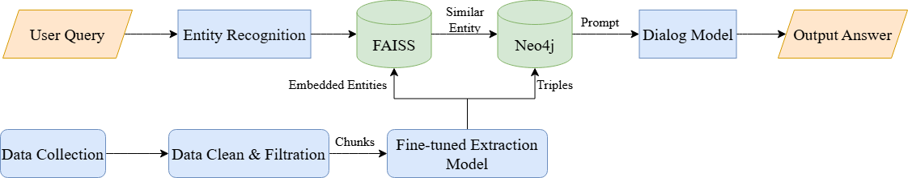
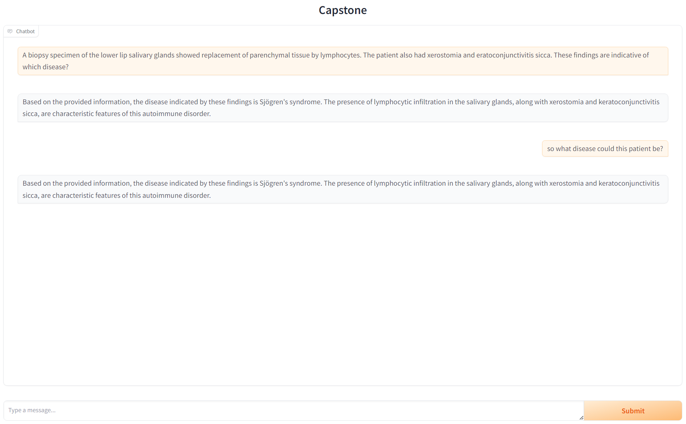

# LLM_for_Dental_Science

This is a Capstone project for **DASC7600**. We are a team of four, and our goal is to enhance the capabilities of LLMs in the field of dental science by incorporating a **knowledge graph** ( • ̀ω•́ )✧ . We spent six months building the entire system framework, and our final results outperform **GPT-3.5**. ᕦ(ò_óˇ)ᕤ

## System Structure (*゜ー゜*)
Below is a brief illustration of our query system structure and our work flow:

First, the user enters a query (User Query), and the system extracts the key entities from the query using the Entity Recognition module.  
The recognized entities are stored in FAISS, a vector database, through vectorization for fast similar entity retrieval.  
Through FAISS, the system finds the most similar entity from the embedded entities and sends it to the Neo4j graph database, which is used to further obtain the triple information related to the entity.  
In the process of building the knowledge graph, first, Data Collection is performed, and then Data Clean & Filtration is performed on the collected data to ensure the quality of the data.  
The preprocessed data is fed into a fine-tuned information extraction model (Fine-tuned Extraction Model) chunks by chunks.  
The extraction model automatically extracts entities and relations triples from the chunks and then stores entities and relations triples in the Neo4j database.  
When it returns the query-relevant triples, they are incorporated into an appropriate Prompt and input into the Dialog Model to generate a response that matches the user's intent. Eventually, the output of the Dialog Model is the system's answer to the user's query (Output Answer).

## System Demonstration (ﾉ>ω<)ﾉ :｡･:*:･ﾟ’★,｡･:*:･ﾟ’☆
Below is a brief demo using Gradio to show our query system:

## Graph Database ∠( ᐛ 」∠)＿
Below shows a brief illustration of part of the triples in our graph database:
 (Each node represents an entity, and the lines connecting the nodes represent the relationships between them)  

## Thanks for your reading!!!o((>ω< ))o
We have gained a great deal from this project. If you are interested in our work, feel free to contact us via our GitHub. We are happy to share all project files and code. (*^▽^*)

